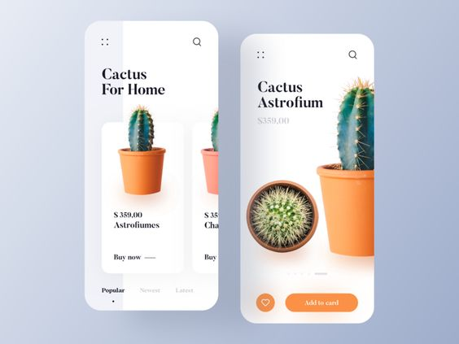

# Cactus App UI

Bringing the Cactus App UI to life using Flutter

> N.B: The assets/font used are very close but not exactly the same as that of the UI design

## Some cool stuff

- Linear Gradient in background 
- Stack widget for horizontal list card
- Radial Gradient as tab indicator

### Getting Started

For help getting started with Flutter, view the 
[Getting Started section of the Flutter docs](https://flutter.dev/docs/get-started/install)

### Reference

[Cactus app UI design by Foxed Studio](https://www.pinterest.com/pin/823244006865979537/)